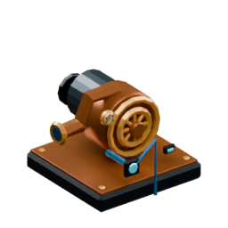
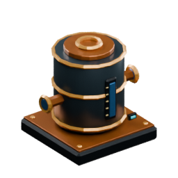

# Pump water automatically

A **Pump** extracts the **water source cell directly below it** and stores that water in its internal 10 L buffer. It needs **no electricity** and takes **2 eligible seconds** to complete one extraction.

> **The Pump does not create water.** For continuous pumping, place it above a source that can renew naturally — the simple 2×2 pool below is the easiest setup.

The most common mistake is placing the Pump **inside** the water layer. The Pump must occupy the block **above** the source water, with water directly beneath its intake.

## What renewable water looks like

This is an actual in-game 2×2 renewable pool. Once two opposite corners have been filled and the water settles, all four cells are source water.


## Start here: build this simple pump setup

### Blocks to bring

| In-game block | Count | What it does |
|---|---:|---|
| <a href="Item-pump.md"></a><br>**Pump** | **1** | Removes the source block directly below it and buffers 10 L |
| <a href="Item-fluid-pipe.md"></a><br>**Fluid Pipe** | As needed | Carries water from a configured output on any free face |
| <a href="Item-water-tank.md"></a><br>**Water Tank** | **1** optional | Easy destination for your first test; a multiblock tank or another water-consuming machine also works |

Bring a [Wrench](Item-wrench.md) to configure the machine-facing pipe ends. Also bring **two Water Buckets**, or one bucket plus a nearby source where you can refill it.

## Build it step by step

### 1 — Dig a 2×2 pool

Dig four water cells, one block deep. All four cells need a **solid floor underneath**.

```text
Top view

. .
. .
```

The floor below this layer must remain solid. Water source renewal needs that support.

### 2 — Fill opposite corners

Place source water in two diagonally opposite corners:

```text
S .
. S
```

`S` = source water

Allow the water simulation to update. The other two cells should fill and become sources too:

```text
S S
S S
```

If the pool only contains flowing water, wait for it to settle and check that you really started with **two opposite source cells**.

### 3 — Put the Pump ABOVE one source

This is the important part. The Pump and its source occupy **two different vertical cells**.

```text
Side view

       P  ← Pump
       S  ← source water directly below
████████  ← solid basin floor
```

Use the side of a temporary support block to place the Pump at the correct height, then remove the support.

> **Do not click the bottom of the basin to place the Pump.** That puts the Pump inside the water layer, replaces the source cell, and leaves solid ground under its intake. The Pump will then report that there is no valid source below it.

### 4 — Connect pipes

The Pump requires no power connection. Connect water and optional automation:
- **Any free face:** Fluid Pipe — hold a [Wrench](Item-wrench.md) and right-click the pump-facing end until it shows a **red Output arrow**.
- **Front:** optional Blue Signal input — leave it disconnected for normal always-on operation.
- **Bottom:** keep this cell available for world-water intake. A pipe placed below would occupy the required source-water cell.

Use the wrench on the destination end to select **blue Input into the tank or machine**. Rotating the Pump does not change configured pipe directions. See [Pipes](Pipes.md) for illustrated connection steps.

**Power Cable does not carry water, and Fluid Pipe does not carry electricity.** Blue Signal is control only; it never supplies electrical power.

### 5 — Give the water somewhere to go

For a first test, connect the Fluid Pipe to a **Water Tank**. You can also connect it to:

- a [multiblock tank](Tanks.md) through an enabled Tank Fluid Port with its pipe end set to **blue Input**;
- a Boiler Engine;
- another machine or vessel that accepts water.

The Pump stops when its 10 L buffer cannot accept another source extraction, so a valid output route matters for continuous operation.

## Check the Pump interface

The in-game Pump interface shows its source-water check, signal state and internal water buffer. Its help confirms that no electricity is required.


A healthy setup has all three basics:

1. **source water directly below**;
2. **enabled signal control** — disconnected, or connected and ON;
3. **room in the output buffer**, normally because a Fluid Pipe is draining it.

The Pump completes an extraction after 40 eligible simulation ticks (two seconds), even during a complete electrical blackout. An attached OFF signal pauses the cycle; a full buffer or unavailable source blocks extraction. Unloaded pumps do not produce water.

## Why the 2×2 pool keeps refilling

The Pump removes a real source block. It is the **water simulation**, not the Pump, that replaces it.

Suppose the Pump extracts the top-left source:

```text
Before extraction       Immediately after

S S                     . S
S S                     S S
```

The empty cell has two horizontal source neighbours and solid support underneath. Water is configured to renew sources in that situation, so the missing corner becomes a source again:

```text
S S
S S
```

Both pumping and natural source renewal work without electricity. The pool can also renew a source removed with a bucket.

### What counts as renewable water?

A missing water cell becomes a new source only when:

- it has at least **two horizontally adjacent water sources**;
- water source renewal is enabled — it is enabled for normal water;
- the missing cell has **solid support or another water source underneath**.

**Flowing water does not count as a source.** The Pump also refuses flowing water.

Water cannot renew through a Pump, machine or solid block. If you accidentally place the Pump in the fourth square of the pool, the block beneath it is still basin floor — no amount of waiting can turn that floor into water. Move the Pump up one block.

## Crafting the Pump

The Pump is crafted at the **4×4 Machinist's Bench**. Its recipe is shapeless, so the ingredient positions do not matter.

<table>
<tr>
<td align="center"><a href="Item-machine-casing.md"></a><br><b>Machine Casing ×1</b></td>
<td>+</td>
<td align="center"><a href="Item-cog.md"></a><br><b>Iron Cog ×1</b></td>
<td>+</td>
<td align="center"><a href="Item-copper-wire.md"></a><br><b>Copper Wire ×4</b></td>
<td>+</td>
<td align="center"><a href="Item-copper-plate.md"></a><br><b>Copper Plate ×2</b></td>
<td>→</td>
<td align="center"><a href="Item-pump.md"></a><br><b>Pump ×1</b></td>
</tr>
</table>

Fluid Pipes are also Machinist's Bench components. Use the in-game recipe browser if you need their upstream components.

## Water buckets and source water

A Water Bucket places a **source** water cell. An empty Bucket can collect source water, but it cannot collect ordinary flowing water.

For the 2×2 setup, place water in two opposite corners and let the other two cells renew naturally. Once all four are sources, the pool is ready for the Pump.

Buckets are also useful for machine startup and emergency transfers. One filled bucket represents the same **10 L** quantity that the Pump holds after one completed extraction.

## Starting a steam power loop

Place the Pump above a renewable source and connect its fluid output to the Boiler. Add coal or charcoal to the Boiler. **The Pump runs without electricity**, so it supplies the initial water before the Alternator starts. No charged battery or manual boiler fill is required.

If water starvation stops generation, the Pump can restore supply while the electrical network is down. Check source renewal, pipe directions, free storage capacity and optional Blue Signal control if water does not arrive.

## Troubleshooting

| Pump status or symptom | What it means / what to check |
|---|---|
| **No water / Below: blocked or not a source** | Check the cell directly below the Pump. The Pump must be one block above a genuine source, not sitting in the water layer. Flowing water is not accepted. |
| **Disabled by signal** | A Blue Signal connection is attached and currently OFF. Turn it ON or remove the optional control connection. |
| **Output full** | The 10 L internal buffer cannot accept another extraction. Connect a Fluid Pipe on any face, set the pump-facing end to red Output with a held Wrench, and send water to storage with free capacity. |
| **Works once, then stops** | Usually the output buffer is not draining, or the removed source is not renewing. Check both the fluid route and the 2×2 source layout. |
| **Pool does not refill** | Make sure there are two horizontal source neighbours, solid support below, and that you did not replace a water cell with the Pump itself. |
| **Pipe is connected but destination stays empty** | Use a held Wrench to set the pump-facing pipe end to red Output and the destination end to blue Input; confirm the destination accepts water and any tank port is Enabled. |
| **Boiler stays dry** | The Pump needs no electricity. Check its source, signal control and fluid route; set the boiler-facing pipe end to blue Input. |

For larger storage setups, continue with [Build a multiblock tank](Tanks.md). For generators, cables and storage, see [Electricity and batteries](Electricity-and-batteries.md).
