# Build a multiblock tank

A multiblock tank is a **sealed, hollow box that you build from individual tank blocks**. The easiest way to learn it is to copy the small 3×3×3 example below first, get it to form, and only then build larger tanks.

> **Do not fill the inside with water blocks.** The inside of the structure must stay empty air. The tank stores fluid in the machine itself.

This is different from the single-block **Water Tank**, which stores 100 L on its own.

## What a finished tank looks like

This is an actual in-game Rivet Reach multiblock tank. The dark reinforced blocks make the frame, the large panels/glass fill the faces, and the controller/ports replace ordinary side panels.


## Start here: build this 3×3×3 tank

A 3×3×3 tank is the smallest possible multiblock tank. It has one empty block of interior space and stores **250 L**.

### Blocks to bring

| In-game block | Count | What it does |
|---|---:|---|
| <a href="Item-tank-frame.md">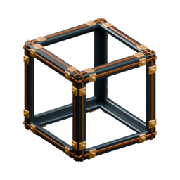</a><br>**Reinforced Tank Frame** | **20** | Every corner and every edge block |
| <a href="Item-tank-wall.md">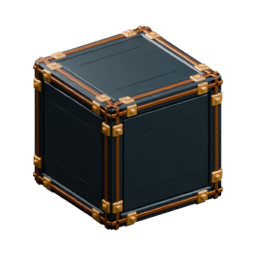</a><br>**Tank Wall** | **2** | Centre of the floor and roof |
| <a href="Item-tank-controller.md">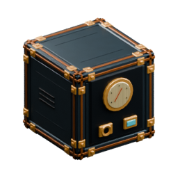</a><br>**Tank Controller** | **1** | Required. Forms and manages the tank |
| <a href="Item-tank-hatch.md">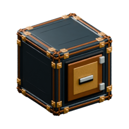</a><br>**Tank Access Hatch** | **1** | Optional but convenient for buckets |
| <a href="Item-tank-port.md">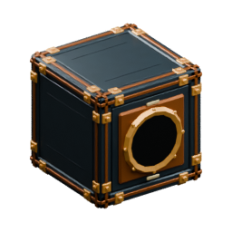</a><br>**Tank Fluid Port** | **2** | One INPUT and one OUTPUT in this example |

The **Access Hatch is optional** because the controller can also accept buckets. Any unused side-panel position can instead be a **Tank Wall** or **Reinforced Tank Glass**. A tank must have **exactly one Tank Controller**.

## Build it layer by layer

The diagrams below are **top views**. Imagine looking straight down at each horizontal layer while building upward.

**Legend**

- `F` = Reinforced Tank Frame
- `W` = Tank Wall
- `C` = Tank Controller
- `H` = Tank Access Hatch
- `I` = Tank Fluid Port whose pipe end is configured as blue INPUT
- `O` = Tank Fluid Port whose pipe end is configured as red OUTPUT
- `.` = **empty air — do not place a block here**

### Layer 1 — floor

Place 8 frames around the outside and a Tank Wall in the middle.

```text
F F F
F W F
F F F
```

The result is a completely filled 3×3 floor.

### Layer 2 — sides and empty interior

This is the important layer. The centre stays completely empty.

```text
F O F
I . H
F C F
```

The four corners are frames. The four middle positions on the outside faces are where side panels or functional tank blocks go.

> **The controller, hatch and ports must face OUTWARD.** Stand outside the tank when placing them. Their visible face/nozzle should point toward you, with the empty tank interior behind the block. If one faces inward, open its interface and rotate it in 90° steps.

### Layer 3 — roof

Close the tank with the same pattern as the floor:

```text
F F F
F W F
F F F
```

### Check that it formed

Open the **Tank Controller**. A correct build should report:

```text
FORMED · 3 × 3 × 3
Capacity: 250 L
```

Validation also runs automatically when nearby blocks change. **RE-SCAN** asks the controller to check the structure again.

If it does not form, jump to [Troubleshooting](#troubleshooting).

## Crafting the tank blocks

All tank-component recipes below use the **4×4 Machinist's Bench**. They are **shapeless recipes**: the ingredient positions in the 4×4 grid do not matter. The icons shown here are the same rendered item icons used by the game.

### Reinforced Tank Frame ×4

<table>
<tr>
<td align="center"><a href="Item-iron-plate.md">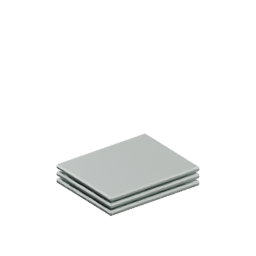</a><br><b>Iron Plate ×3</b></td>
<td>+</td>
<td align="center"><a href="Item-rivets.md">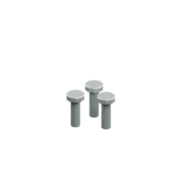</a><br><b>Rivets ×4</b></td>
<td>+</td>
<td align="center"><a href="Item-copper-plate.md"></a><br><b>Copper Plate ×1</b></td>
<td>→</td>
<td align="center"><a href="Item-tank-frame.md"></a><br><b>Frame ×4</b></td>
</tr>
</table>

For the example tank you need **20 frames**, so craft this recipe **5 times**.

### Tank Wall ×4

<table>
<tr>
<td align="center"><a href="Item-machine-casing.md"></a><br><b>Machine Casing ×1</b></td>
<td>+</td>
<td align="center"><a href="Item-iron-plate.md"></a><br><b>Iron Plate ×4</b></td>
<td>→</td>
<td align="center"><a href="Item-tank-wall.md"></a><br><b>Tank Wall ×4</b></td>
</tr>
</table>

Keep some Tank Walls available: the controller, ports and hatch below are themselves crafted from Tank Walls.

### Tank Controller ×1

<table>
<tr>
<td align="center"><a href="Item-tank-wall.md"></a><br><b>Tank Wall ×1</b></td>
<td>+</td>
<td align="center"><a href="Item-cog.md"></a><br><b>Cog ×1</b></td>
<td>+</td>
<td align="center"><a href="Item-azure-crystal.md">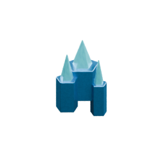</a><br><b>Azure Crystal ×1</b></td>
<td>→</td>
<td align="center"><a href="Item-tank-controller.md"></a><br><b>Controller ×1</b></td>
</tr>
</table>

Every tank needs **exactly one** controller.

### Tank Fluid Port ×1

<table>
<tr>
<td align="center"><a href="Item-tank-wall.md"></a><br><b>Tank Wall ×1</b></td>
<td>+</td>
<td align="center"><a href="Item-fluid-pipe.md">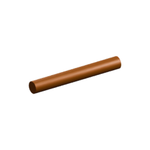</a><br><b>Fluid Pipe ×1</b></td>
<td>→</td>
<td align="center"><a href="Item-tank-port.md"></a><br><b>Fluid Port ×1</b></td>
</tr>
</table>

The example uses two ports so it can have a clearly separate INPUT and OUTPUT, but larger designs can use more.

### Tank Access Hatch ×1 — optional

<table>
<tr>
<td align="center"><a href="Item-tank-wall.md"></a><br><b>Tank Wall ×1</b></td>
<td>+</td>
<td align="center"><a href="Item-copper-plate.md"></a><br><b>Copper Plate ×2</b></td>
<td>→</td>
<td align="center"><a href="Item-tank-hatch.md"></a><br><b>Access Hatch ×1</b></td>
</tr>
</table>

The hatch gives you another convenient place for 10 L bucket transfers. It is not required to form the tank.

### Reinforced Tank Glass ×4 — optional side panel

<table>
<tr>
<td align="center"><a href="Item-glass.md">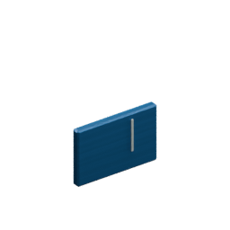</a><br><b>Glass ×4</b></td>
<td>+</td>
<td align="center"><a href="Item-rivets.md"></a><br><b>Rivets ×4</b></td>
<td>→</td>
<td align="center"><a href="Item-tank-glass.md">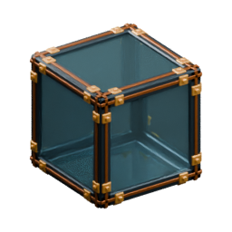</a><br><b>Tank Glass ×4</b></td>
</tr>
</table>

Glass can replace ordinary wall panels on the **vertical sides**. Do not use it in the centre of the floor or roof; those positions require solid Tank Wall.

## Fill and connect the tank

### With buckets

Bring a Water Bucket and open either the **Tank Controller** or **Tank Access Hatch**. Use **ADD 10 L** to put water into the tank and **TAKE 10 L** to remove it.

### With Fluid Pipes

1. Enable a Tank Fluid Port and connect a Fluid Pipe on an accessible face.
2. Hold a [Wrench](Item-wrench.md) and right-click the tank-facing pipe end until its **blue Input arrow** points into the tank.
3. Connect the source end to stored water, with a **red Output arrow** pointing out of that source.
4. For delivery, attach another pipe and set its tank-facing end to **red Output** with the wrench.
5. Connect its outward-facing nozzle to the machine/tank that should receive water.

**Power Cable does not carry water.** Fluid, electrical power and Blue Signal are separate networks.

## Rules for larger tanks

Once the 3×3×3 example works, you can scale the same construction up.

- Each **outer dimension** may be from **3 to 9 blocks**.
- The dimensions do not have to match. For example, **6×4×5** is valid.
- **Every corner and every edge block** must be Reinforced Tank Frame.
- The **centre areas of the floor and roof** must be solid Tank Wall.
- The **vertical face centres** may use Tank Wall, Reinforced Tank Glass or functional tank components.
- The entire inside volume must remain **empty air**.
- There must be **exactly one Tank Controller**.
- Controller, ports, hatch, valve and level sensor must face **outward**.

Capacity is based on the empty interior volume:

```text
(width − 2) × (height − 2) × (depth − 2) × 250 L
```

Examples:

| Outer size | Empty interior | Capacity |
|---|---|---:|
| 3×3×3 | 1×1×1 | 250 L |
| 4×4×4 | 2×2×2 | 2,000 L |
| 6×4×5 | 4×2×3 | 6,000 L |
| 9×9×9 | 7×7×7 | 85,750 L |

## Advanced tank components

These are not needed for your first tank.

### Signal Valve Port

<a href="Item-tank-valve.md">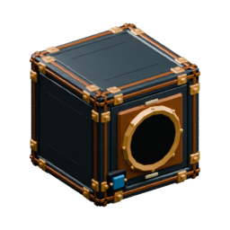</a>

Craft **1 Tank Fluid Port + 1 Signal Conduit → 1 Signal Valve Port** at the Machinist's Bench.

It replaces an ordinary side port. Enable its port, set the adjoining pipe end with a held [Wrench](Item-wrench.md), and connect Blue Signal to the keyed signal fitting. **ON opens the valve; OFF or no attached signal keeps it closed.** Fluid and signal can share a fitted Fluid Pipe while remaining independent channels.

### Tank Level Sensor

<a href="Item-tank-sensor.md">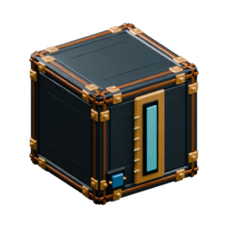</a>

Craft **1 Tank Wall + 1 Signal Wire + 1 Glass → 1 Tank Level Sensor** at the Machinist's Bench.

It outputs Blue Signal when the stored percentage reaches its configured threshold. See [Blue Signal](Blue-Signal.md).

## Troubleshooting

| Controller message or symptom | What it means / what to check |
|---|---|
| **Interior must be empty behind controller** | Something occupies the hollow interior, or the controller faces inward. Empty the inside and rotate the controller outward. |
| **Missing Reinforced Tank Frame** | A corner or edge block is not a Reinforced Tank Frame. Frames are not just decorative corners — every edge cell needs one. |
| **Floor and roof require solid Tank Wall** | Glass or a functional component was placed in a floor/roof face centre. Replace it with Tank Wall. |
| **Rotate component to face outside** | The named controller, hatch, port, valve or sensor points into the tank. Rotate it 90° until its working face points away from the interior. |
| **Interior open / shell incomplete** | A required shell position is missing. Close the outside shell while leaving only the inside hollow. |
| **Waiting for neighbouring chunk** | Part of the structure is not currently loaded. Move close enough that the whole tank is resident. |
| **Formed, but no fluid arrives** | Check that the port is Enabled, its pipe end is blue Input, the source end is red Output with stored fluid, and any Signal Valve is ON. |

The controller reports the first failed coordinate and highlights that location in the world.

## Repairs and dismantling

Breaking any shell block suspends normal transfers, but the stored liquid remains with the controller. Repair the shell and let it validate again.

**Do not mine a non-empty controller.** Drain the tank first using buckets, a normal output port while formed, or **RECOVERY OUT** on the controller. Recovery works even when the structure is invalid and lets a Fluid Pipe drain quantities smaller than one bucket.

If you resize a tank smaller than its current contents can fit, drain enough liquid before the smaller structure can become valid.

A bank of batteries is a different kind of multiblock and is **solid rather than hollow**: see the [battery-bank guide](Electricity-and-batteries.md).

## Pipe direction controls

Fluid Pipes can meet any accessible face of a functional fluid port. Direction changes require a **selected [Wrench](Item-wrench.md) and right-click on the machine-facing pipe end**. Empty hands, other items and Interact cannot change them. Rotating the tank part does not reverse configured ends. The port interface enables/disables transfer; the wrench chooses each end’s direction. See [Pipes](Pipes.md).
